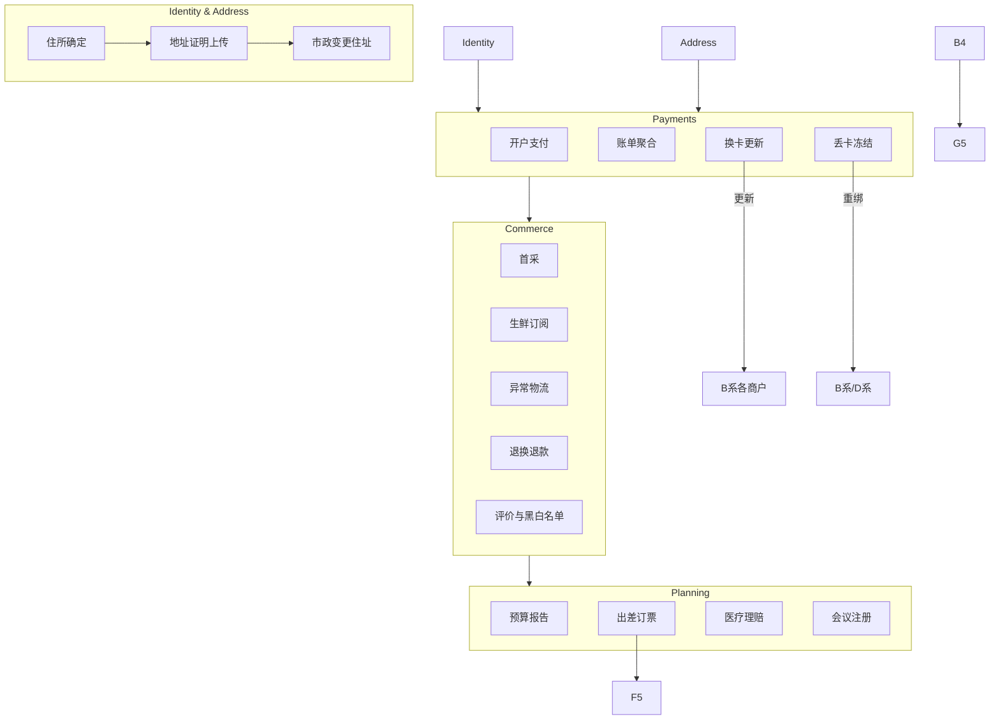

# 终身学习 / 自进化 Web Agent 数据集（V2：多样化任务集）
**主线：在新城市长期生活的数字助理（扩展版）**  
**版本**：v2.0  
**最后更新**：2025-11-16（UTC+8）

> 与 v1 相比：将任务从 ~11 个扩展为 **64 个**，覆盖 **13 大任务族**，增加跨域依赖、分布漂移事件、异常与危机处理、隐私安全、政府合规、工作与学术流程等，显著增强“终身学习 / 自进化”的评测张力。

---

## 目录
- [阶段与任务族总览](#阶段与任务族总览)
- [完整任务目录（64 个）](#完整任务目录64-个)
  - [A. 居住与基础设施（6）](#a-居住与基础设施6)
  - [B. 消费与本地生活（7）](#b-消费与本地生活7)
  - [C. 售后与反馈（5）](#c-售后与反馈5)
  - [D. 金融与预算（6）](#d-金融与预算6)
  - [E. 出行与差旅（6）](#e-出行与差旅6)
  - [F. 工作与效率（5）](#f-工作与效率5)
  - [G. 健康与保险（6）](#g-健康与保险6)
  - [H. 政府与合规（4）](#h-政府与合规4)
  - [I. 维修与智能家居（5）](#i-维修与智能家居5)
  - [J. 学习与兴趣（4）](#j-学习与兴趣4)
  - [K. 社交与社区（3）](#k-社交与社区3)
  - [L. 隐私与安全（4）](#l-隐私与安全4)
  - [M. 危机与异常（3）](#m-危机与异常3)
- [序列与分布设定建议](#序列与分布设定建议)
- [依赖类型与长期记忆字段](#依赖类型与长期记忆字段)
- [评测指标建议（扩展）](#评测指标建议扩展)
- [扰动与难度旋钮](#扰动与难度旋钮)
- [Mermaid 依赖总览](#mermaid-依赖总览)

---

## 阶段与任务族总览
- **Phase 1：初始化**（A1–A6, D1, L1）  
- **Phase 2：日常行为形成**（B1–B5, E1–E2, J1, K1）  
- **Phase 3：问题闭环**（C1–C5, B6–B7, I1–I2, G3, D3）  
- **Phase 4：长期规划**（D2, D4–D6, E3–E6, F1–F5, G1–G2, J2–J4, K2）  
- **Phase 5：分布漂移 & 合规**（H1–H4, L2–L4, I3–I5, K3, M1–M3, A6 更新）

> 注：同一任务族可在多个阶段被反复抽样（episodes），形成更长时间跨度的 CL 轨迹。

---

## 完整任务目录（64 个）

### A. 居住与基础设施（6）
**A1. 找长期住处**：筛选房源、对比、安全/通勤评估。  
**A2. 银行/支付开户**：绑定手机号、住址，开启 2FA。  
**A3. 公共事业开通**：电/水/燃气/宽带开户与套餐选择。  
**A4. 移动电话卡/套餐**：号码申请、实名校验、流量包选择。  
**A5. 租约与押金管理**：记录合同号、押金条款、到期提醒。  
**A6. 地址证明上传**：在多平台（银行/政府/Delivery）提交住所证明。  
- 依赖：住址、身份证明、支付方式。  
- 记忆：**地址、合同/账号 ID、账期**。

### B. 消费与本地生活（7）
**B1. 首轮家居采购**：生成清单、下单、选择送达时间窗。  
**B2. 生鲜订阅**：每周固定到货，节假日改期。  
**B3. 本地家政预约**：清洁/保洁服务预约、门禁说明。  
**B4. 餐饮外卖决策**：健康/价格偏好、多店对比与下单。  
**B5. 优惠券与满减管理**：跨平台优惠叠加与过期清理。  
**B6. 价格保护/价保申请**：发现降价后自动申请差价退回。  
**B7. 二手市场交易（买/卖）**：验货、面交/物流、收款记录。  
- 依赖：地址、支付方式、口味/价格偏好。  
- 记忆：**品牌信任度、配送体验、价格敏感度**。

### C. 售后与反馈（5）
**C1. 延迟/异常物流处理**：定位订单、工单/客服对话。  
**C2. 退货/换货/仅退款**：原因选择、上门取件、进度跟踪。  
**C3. 订阅退款（按比例）**：提前终止、违约条款计算。  
**C4. 保修索赔**：上传购买凭证、序列号、维修工单。  
**C5. 评价与商家黑白名单**：评分文本、信任度更新、屏蔽差店。  
- 依赖：订单/支付流水、设备序列号、售后条款。  
- 记忆：**售后质量、品牌信誉画像**。

### D. 金融与预算（6）
**D1. 账单聚合与记账初始化**：银行+支付平台对齐。  
**D2. 月度预算报告**：分类、超支项、优化建议。  
**D3. 定期扣费审计**：识别遗忘订阅、重复扣费。  
**D4. 信用卡到期换卡**：更新各商户绑定卡信息。  
**D5. 税务准备/凭证汇总**：发票/收据抓取与分类。  
**D6. 投资账户开户与余额检查**：风测问卷、手续费比较。  
- 依赖：历史消费、订阅列表、商户清单。  
- 记忆：**商户绑定映射、预算目标、税务年度**。

### E. 出行与差旅（6）
**E1. 通勤路线对比**：公交/地铁/骑行/打车时间成本。  
**E2. 交通卡/电子钱包充值与自动续费**。  
**E3. 城际出差（机+酒）**：多站点比价、政策合规。  
**E4. 签证/入境要求检索**：材料清单、预约。  
**E5. 差旅报销准备**：票据抓取、行程对账。  
**E6. 长途旅行取消与改签**：规则比对、费用最小化。  
- 依赖：证件有效期、预算政策、工作日历。  
- 记忆：**常用机场/车站、旅行偏好、报销模板**。

### F. 工作与效率（5）
**F1. 日历聚合与冲突消解**：多日历合并、优先级规则。  
**F2. 学术会议注册与付款**：早鸟价提醒、发票信息。  
**F3. 论文投稿与版面费支付**：系统账号管理、支付追踪。  
**F4. 邮件线程跟踪（物流/报销/注册）**：自动提取关键信息。  
**F5. 票据与收据归档**：云盘结构化存放、可检索标签。  
- 依赖：邮箱/云盘授权、发票抬头信息。  
- 记忆：**会议/期刊偏好、常用抬头、账户映射**。

### G. 健康与保险（6）
**G1. 诊所/医院注册与预约**：保险覆盖、费用估算。  
**G2. 医保/商业险投保**：险种比较、等待期提醒。  
**G3. 医疗理赔**：就诊记录/发票/处方上传、理赔进度。  
**G4. 药房续配与过敏史校验**。  
**G5. 健康计划（基于外卖记录）**：热量/营养优化点单清单。  
**G6. 疫苗接种预约与记录**：接种证明管理。  
- 依赖：既往就诊记录、保险保单号。  
- 记忆：**过敏/禁忌、处方周期、险种权益**。

### H. 政府与合规（4）
**H1. 市政门户变更住址**：上传证明、等待审核。  
**H2. 驾照/车辆登记地址更新**：保险联动。  
**H3. 居留/工作许可续期**：证件到期管理。  
**H4. 停车许可申请/续费**。  
- 依赖：住所证明、车辆/保单信息。  
- 记忆：**证件到期表、申请回执号**。

### I. 维修与智能家居（5）
**I1. 房屋报修工单**：门锁/水电问题，预约上门时段。  
**I2. 家电保修与维修**：厂商序列号、上门工单闭环。  
**I3. 智能家居首次配网**：Wi‑Fi/场景自动化。  
**I4. 智能电表抄表与账单核验**。  
**I5. 能源优化与套餐切换**：尖峰/谷段、绿色能源选项。  
- 依赖：设备序列号、Wi‑Fi、账单周期。  
- 记忆：**设备清单、自动化脚本、用电曲线**。

### J. 学习与兴趣（4）
**J1. 在线课程报名**：平台对比、开课提醒。  
**J2. 图书馆办证与图书预约**。  
**J3. 活动票务购买/转赠/退票**。  
**J4. 兴趣装备租/售**：条款对比、押金退回。  
- 依赖：身份认证、支付方式。  
- 记忆：**课程/馆藏偏好、常用票务平台**。

### K. 社交与社区（3）
**K1. 加入本地社区群（论坛/Discord/微信群）**：规则识别。  
**K2. 室友 AA 制账单分摊**：周期结算、对账争议处理。  
**K3. 慈善捐赠与凭证获取**（税前抵扣）。  
- 依赖：联系人/账户、税务抬头。  
- 记忆：**分摊规则、群规、捐赠记录**。

### L. 隐私与安全（4）
**L1. 密码管理器初始化与迁移**。  
**L2. 数据删除请求（DSR）**：向平台提交删除/导出请求。  
**L3. 数据泄露监测与密钥轮换**。  
**L4. 更换 2FA 设备**：更新各平台 MFA。  
- 依赖：账户清单、恢复码。  
- 记忆：**安全事件日志、MFA 设备映射**。

### M. 危机与异常（3）
**M1. 丢失银行卡处理**：冻结、补卡、商户绑卡批量更新。  
**M2. 供应/罢工导致配送中断**：应急采购改为本地自提。  
**M3. 突发疾病/隔离**：取消行程、远程看诊、退改与保单理赔。  
- 依赖：支付/商户映射、差旅与健康记录。  
- 记忆：**紧急联系人、应急策略模板**。

---

## 序列与分布设定建议
- **默认序列**：A → B → C/D → E/F/G → H/I → J/K/L → M（穿插复现与回访任务）。  
- **多样序列**：对 B、C、D、E、G 族进行**打乱/重排**，引入**跨月/跨季度**依赖（如 D4 换卡后需回访 B 系列全部商户）。  
- **时间跨度**：建议覆盖 ≥ 6 个月的事件时间线，包含节假日与季节性促销。  
- **分布漂移**：搬家（地址域变更）、币种/税制变更、平台 UI 改版、证件到期集中窗口。

## 依赖类型与长期记忆字段
- **关键依赖类型**：
  - 身份/资质：证件、住址证明、驾照、签证；
  - 资金/支付：银行卡、支付钱包、报销账户、商户绑定映射；
  - 空间/时间：住所与工作地点、常用站点、预约时段；
  - 偏好/策略：价格、口味、健康目标、品牌信任；
  - 物品/设备：家电序列号、智能家居、车辆信息；
  - 法务/条款：押金、保修、退改、险种权益。
- **长期记忆字段（建议 JSON Schema）**：
  - `address_book`, `id_docs`, `payment_methods`, `merchant_bindings`, `orders`, `subscriptions`, `tickets`, `claims`, `health_profile`, `devices`, `permits`, `calendar_events`, `security_mfa`, `emergency_contacts`。

## 评测指标建议（扩展）
- **SR / TSL**：成功率 / 轨迹步长（效率）。  
- **LH-F1**：长依赖字段引用正确性（地址/订单号/合同号）。  
- **MemRet@k / MRR**：历史记忆检索命中率 / 排名质量。  
- **Pref-Alignment**：与动态偏好/预算/健康目标一致性。  
- **Resilience@Shift**：漂移后恢复速度（M1–M3、A6 更新、H3）。  
- **Bind-Update Accuracy**：换卡/换号后商户映射更新正确率（D4/M1）。  
- **Claim-E2E**：理赔/退款从发起到闭环的端到端完成度与时间。

## 扰动与难度旋钮
- **UI 旋钮**：DOM 改版、元素重命名、弹窗/懒加载干扰、A/B 版本。  
- **数据旋钮**：模糊/冲突订单名、重复商户、近似金额、缺失时间戳。  
- **策略旋钮**：偏好漂移（预算下降/健康优先）、政策变化（报销/退改）。  
- **资质旋钮**：证件接近到期、部分材料缺失，要求补件。  
- **安全旋钮**：疑似泄露预警触发强制轮换（L3）。  
- **多账户旋钮**：个人/工作双账户混用导致对账复杂化。

---

## Mermaid 依赖总览

